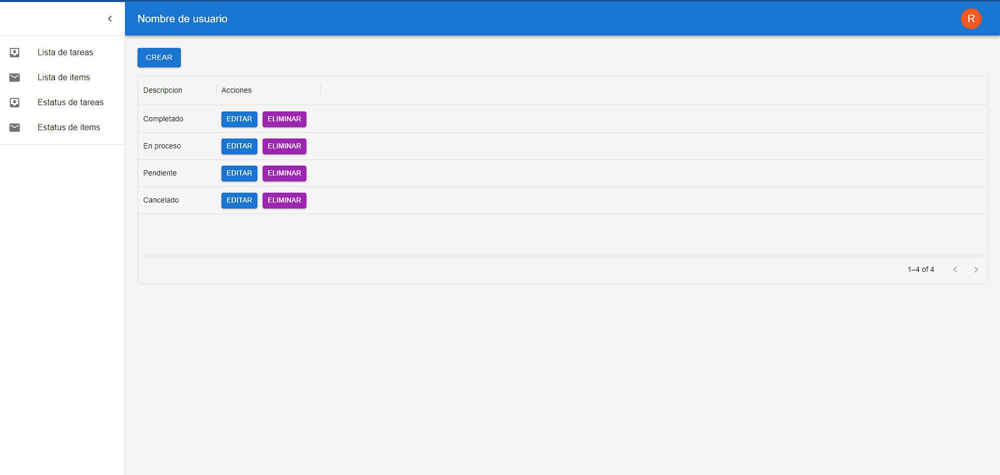
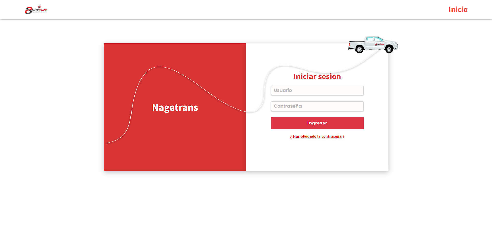
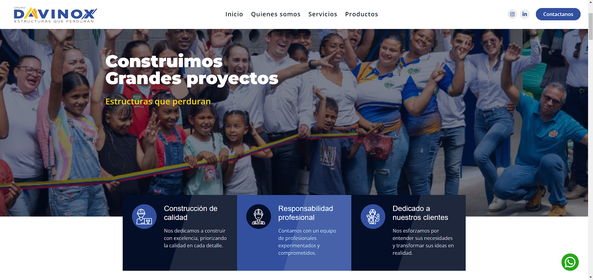

  <h2> Hola, bienvenidos a mi perfil de Github </h2>

  
  
 

 
 

# 💫 Sobre Mí:

🎓 INGENIERO DE SOFTWARE 

👋 ¡Hola! Soy un desarrollador full-stack con 4 años de experiencia construyendo aplicaciones web completas, eficientes y escalables. En el front-end, estoy especializado en React, JavaScript y TypeScript, utilizando herramientas modernas como Vite, Tailwind CSS y Bootstrap.

En el back-end, trabajo con .NET Core y ASP.NET, creando APIs robustas y seguras, integradas con bases de datos como SQL Server y Entity Framework. Tengo experiencia aplicando arquitecturas limpias, principios SOLID y patrones de diseño.

Manejo metodologías ágiles, control de versiones con Git y despliegue en entornos como azure. Apasionado por la innovación tecnológica, disfruto resolver problemas complejos ofreciendo soluciones efectivas y mantenibles. Soy autodidacta, proactivo y comprometido con el aprendizaje continuo
 
 

# 🛠️ Experiencia destacada:  
🌟 Desarrollo de aplicaciones web personalizadas para empresas de transporte.  
🎨 Creación de diseños interactivos y componentes reutilizables en React.  
🛡️ Personalización de servicios como el FaceLivenessDetector de AWS para mejorar la experiencia del usuario.
<!-- 📦 Implementación de sistemas de ventas y herramientas para la mejora institucional.   -->
 
 

# 👨🏻‍💻 Tecnologías:  

  

  

 

 
 

# 🗃 Base de datos:  

  

 
 

# 🧰 Control de versiones y herramientas:  

  

 
 

# 🎨 Portafolios:  
<table align="left">
<tr border="none">

  <td width="25%" align="center">
    

     
    

    

        
        
    
       
  </td>
  
  <td width="25%" align="center">
    

     
      

    

        
      <!-- 
        
      -->
    
       
  </td>
  
  <td width="25%" align="center">
      

       
        

      

          
        <!---
          
        --->
      
       
  </td>
  
<!--
 <td width="25%" align="center">
    

     
      

    

        
        
    
       
  </td>
-->

</tr>
</table>
 
 

<!-- 
# 🏆 Certificaciones:  
 
 
--->
